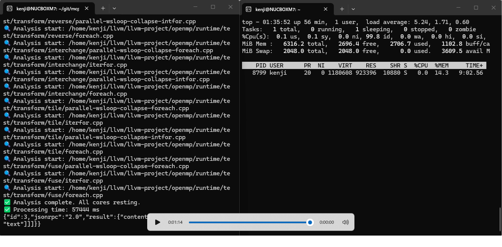

# mcp-cst-core — Structural Analysis Infrastructure for the AI Era
# mcp-cst-core — AI時代の構造解析基盤

**LLVM-scale codebase mapping in <1 min, <910MB RAM.**  
**LLVM級の巨大コードベースを1分・910MB以下で完全把握。**

---

## 🧠 Vision / ビジョン

**Analysis stays Local. AI uses the Structure as its "Brain".**  
**解析はローカルで。AIはその構造を“頭脳”として使う。**

LLMs are statistical computers. Without correct structured data, they are bound to fail. `mcp-cst-core` was born to establish the prerequisite for the next generation of AI code comprehension.

AIは統計計算機であり、正しい構造化データがなければ誤る。  
`mcp-cst-core` は、AIが本当に必要としていた“構造の基盤”を提供するために生まれました。

*   **Local Analysis:** Parses deep codebases right where your data belongs.  
    **コードをローカルで解析する**
*   **S-Expression & JSON:** Delivers the raw, flawless structure directly to the model.  
    **構造を S式 / JSON として提供する**
*   **The World Model:** Empowers AI to utilize code structures as an actionable map.  
    **AI がその構造を「世界モデル」として利用する**
*   **Incremental Exploration:** Safely navigates massive codebases like LLVM step-by-step.  
    **巨大コードベースを安全に段階的に探索する**

---

## 🌳 Utmost Respect to Tree-sitter / Tree-sitter への最大級の敬意

Tree-sitter is a revolution in parsing—fast, precise, incremental, and language-agnostic. This project stands proudly on top of it. **Deepest respect and gratitude to the authors and the community.**

Tree-sitter は構文解析の革命です。高速・正確・インクリメンタル・言語非依存。  
このプロジェクトは Tree-sitter の上に成り立っています。**作者とコミュニティに深い敬意と感謝を。**

---

## 🌱 Gratitude for S-Expressions / S式という贈り物への感謝

The S-expression is a beautiful gift—a form that maps nested structures directly and elegantly, effortlessly understood by both humans and AI. By projecting Tree-sitter’s concrete syntax trees into S-expressions, AI can finally perceive the "true geometry" of source code.

S式は、構造をそのまま表現できる美しい形式です。AIにとっても、人間にとっても扱いやすい。  
Tree-sitter の構造を S式に変換することで、AIは初めて“正しい構造”を理解できます。

---

## ⚙️ Design Philosophy / 設計思想

*   **No Pipe Over-engineering (`main` is the Pipe):** The MCP/STDIO layer is just a high-speed pipe. We purposefully do not separate or encapsulate it into useless classes. `main()` directly handles the I/O loop to minimize abstraction bloat.
    **土管（MCP）は分ける必要なし、`main`直撃の設計**：通信の窓口に過ぎないMCP層の過剰なクラス隠蔽を拒絶。`main()`がSTDIOループをストレートに掴むことで、無駄なオブジェクト生成や抽象化のオーバーヘッドをゼロにしています。
*   **The Golden Separation (Main & CST Only):** The only conceptual boundary is between the Pipe (`main`) and the Structure (`CST` class). This strict minimalism keeps the implementation under `<400 lines` of pure, single-file C++.
    **「メイン（土管）とCST（構造）」の一刀両断**：唯一分けるのは、通信の土管（`main`）と、重厚な解析・メモリ管理を司る`CST`クラスのみ。この引き算の美学が、400行以下の美しいシングルソースを実現しています。
*   **AI-First API:** Clean separation of concerns designed for model context (`overview` / `detail` / `next` [WIP]). AI doesn't need a full text dump; it explores the map structured by local power.
    **AIファーストAPI**：`overview` / `detail` / `next`（次世代エージェント向けに計画中）。AIにテキストを丸呑みさせるのではなく、ローカルが作った地図を段階的にAIの頭脳に渡していく、次世代エージェントのためのインターフェース設計です。
*   **Massive Codebase Readiness:** Powered by CST caching, partial restoration, and step-by-step exploration.  
    **巨大コード対応**：CSTキャッシュ、部分復元、段階探索
*   **Hyper-Scalable Parallelism:** Standardizes on 10 physical threads, linearly scalable up to `-j 256` via pure C++20.  
    **スケーラブル**：デフォルト10スレッド、`-j 256`も可能
*   **Open World & Hackable:** No modular over-engineering. Anyone who can read basic C++ can fully master, fork, and customize this beast in 10 minutes.
    **カスタマイズ自由なハッカーの玩具**：無駄なブラックボックスはありません。C++を少し読める人なら、10分でコードのすべてを完全把握し、自分好みにガシガシ改造して遊べます。

---

## 🚀 To Future AI Agents / 未来のエージェントへ

As of today, there is no AI agent capable of fully unleashing the true potential of this infrastructure. **And that is by design.**

**This is a foundation engineered explicitly for the Next-Generation AI Agents.**

今はまだ、この基盤を完全に扱えるエージェントは存在しません。それは当然です。  
**これは“次世代のAIエージェント”のために作られた基盤だから。**

---

## 🏆 Why this is "Future Award" Class / 未来賞レベルの理由

*   A future where AI fundamentally understands code structure, not just text streams.  
    **AIが構造を理解する未来**
*   A future where local-first, privacy-safe analysis becomes the universal standard.  
    **ローカル解析が標準になる未来**
*   A future where gigabyte-scale repositories are safe to explore without context crash.  
    **巨大コードを安全に扱う未来**
*   A future where Specification → Code → Tests are seamlessly unified through structure.  
    **仕様→コード→テストが構造でつながる未来**

`mcp-cst-core` is the blueprint and the prerequisite for that very future.  
`mcp-cst-core` は、その未来の“前提条件”です。

---

## 🔌 JSON-RPC Protocol Examples / 動作・連携プロトコルの実例

Since `mcp-cst-core` is a pure, ultra-minimal STDIO LocalMCP server, you can interface with it directly using raw JSON-RPC. Here is the exact sequence to initialize the server, list tools, map LLVM, and extract fine-grained S-expressions.

外部ラッパーを排した純粋なSTDIOサーバーであるため、標準入力から直接JSON-RPCを流し込んでテスト・連携が可能です。以下はサーバー初期化からLLVM全体の構造化、そしてオンデマンド抽出に至る正確なリクエストシーケンスです。

### 1. Initialize Server / サーバー初期化
```json
{"jsonrpc": "2.0", "id": 1, "method": "initialize", "params": {"protocolVersion": "2024-11-05", "capabilities": {}, "clientInfo": {"name": "manual-test", "version": "1.0.0"}}}
```

### 2. List Available Tools / 利用可能なツール一覧
```json
{"jsonrpc": "2.0", "id": 2, "method": "tools/list", "params": {}}
```

### 3. Create CST (The LLVM Onslaught) / 巨大コードベースの傍若無人な構造化
*This call triggers the 10-thread hyper-parallel compilation and memory-mapping under 1 minute.*  
*このリクエストにより、10スレッド並列による1分未満のLLVM解体・キャッシュ生成が爆走します。*
```json
{"jsonrpc": "2.0", "id": 3, "method": "tools/call", "params": {"name": "CreateCST", "arguments": {"path": "/home/kenji/llvm/llvm-project"}}}
```

### 4. Fetch Global Overview / 全体幾何学マップ（概要）の取得
```json
{"jsonrpc": "2.0", "id": 4, "method": "tools/call", "params": {"name": "getProductSummary", "arguments": {}}}
```

### 5. On-Demand Pinpoint Detail (S-Expression) / キャッシュからの瞬時オンデマンドS式抽出
*Extracts the flawless concrete syntax tree instantly from cache without choking the LLM context.*  
*コンテキストを溢れさせることなく、指定したソースの構造体をキャッシュから瞬時にS式として引き抜きます。*
```json
{"jsonrpc": "2.0", "id": 5, "method": "tools/call", "params": {"name": "getMethodDetail", "arguments": {"symbolPaths": ["home/kenji/llvm/llvm-project/clang/lib/Sema/SemaOpenACCClauseAppertainment.cpp"]}}}
```

---

## 🚀 Real-world Proof / 性能の実証

### Verified Performance (LLVM Project)
*   **Target Codebase Size:** **5.8 GB** (Full llvm-project repository structure)
*   **LLVM Full Indexing Speed:** **57,444 ms** (Under 1 minute!)
*   **Peak Memory Usage:** **901 MB** RAM (RES)

### 🎬 Proof Evidence Screenshot / 証拠の検証実測スクショ

*Left: 10 physical threads devouring LLVM files concurrently down to 57 seconds. Right: Hyper-optimized memory layout keeping RSS at 901MB while virtual space handles the brutal execution heat.*  
*左：10スレッドの暴力でLLVMが57秒で完全パースされる瞬間。右：物理メモリを901MBに抑え込みつつ、裏で仮想メモリが総力戦を繰り広げているトップログ。*

### 🎬 Demo Video / デモ動画
[**Watch the Monster Performance (Video)**](running.mp4)  
*See how 10 physical threads devour the LLVM source in real-time.*

---

## 💻 Benchmark Environment / 検証環境
Tested on a compact mini-PC to prove extreme resource efficiency—proving that you don't need expensive AI data center infrastructure.  
実用的なミニPC環境で「物理コアとC++20の暴力」を実証済み。巨大なサーバーや高価なメモリは不要です。

*   **Device:** GMKTEC M7 (Mini PC)
*   **CPU:** AMD Ryzen 7 PRO 6850H (using `-j 10` for standard runs)
*   **RAM:** 16GB (Approx. 12GB available for App)
*   **Storage:** 512GB SSD
*   **OS Memory Management:** Sub-910MB physical RAM cap achieved via ruthless virtual memory & cache orchestration (VIRT is a battlefield!).

---

## 🛠️ Implementation Detail / 実装の核心
Customize extraction targets per language via S-expression.  
言語ごとの抽出ターゲットをS式で自在に定義可能：

```cpp
{".cpp", {tree_sitter_cpp, "(function_definition) @s (class_specifier) @s"}},
{".ts", {tree_sitter_typescript, "(method_declaration) @s (class_specifier) @s"}}
```

---

## 📦 Requirements / 依存関係
- **C++20** compatible compiler (GCC 11+, Clang 13+)
- **Tree-Sitter**
- **JSON for Modern C++** (`nlohmann/json`)

---

## 📄 License
**MIT License**  
Copyright (c) 2026 Kenji Igarashi

---

## 🤝 Contact & Networking / 繋がり

このプロジェクトに興味を持っていただきありがとうございます！技術的な質問や、エンジニア同士の交流、共同開発のお誘いなど、LinkedInでの繋がりを大歓迎しています。
Thank you for checking out this project! I would love to connect with fellow developers. Please feel free to add me on LinkedIn for tech discussions, networking, or collaboration!
[](https://www.linkedin.com/in/kenjiigarashi/)
